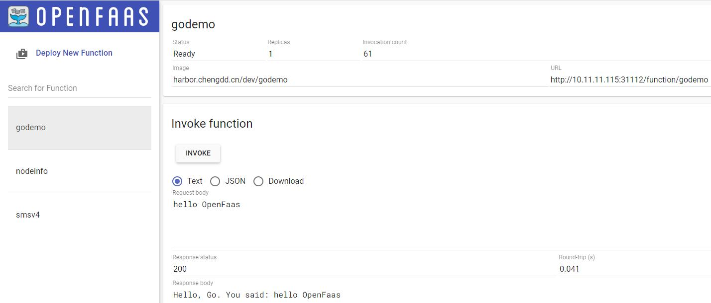

# OpenFaas_Demo
OpenFaas GoLang Demo  
  

## godemo
给指定手机号发送短信

### 部署
```shell
$ git clone https://github.com/openfaas/faas-netes
$ cd openfaas/faas-netes
$ kubectl apply -f namespaces.yml
$ kubectl -n openfaas create secret generic basic-auth --from-literal=basic-auth-user=admin --from-literal=basic-auth-password=admin
$ cd yaml
$ kubectl apply -f .
```
检查所有应用running后，页面访问http://node01:31112/ui/  
> 用户名：admin
> 密码：admin

### 调用
```shell
curl --location --request GET 'http://10.11.11.115:31112/function/smsv4' \
    --header 'Content-Type: text/plain' \
    --data '12356332824'
```
